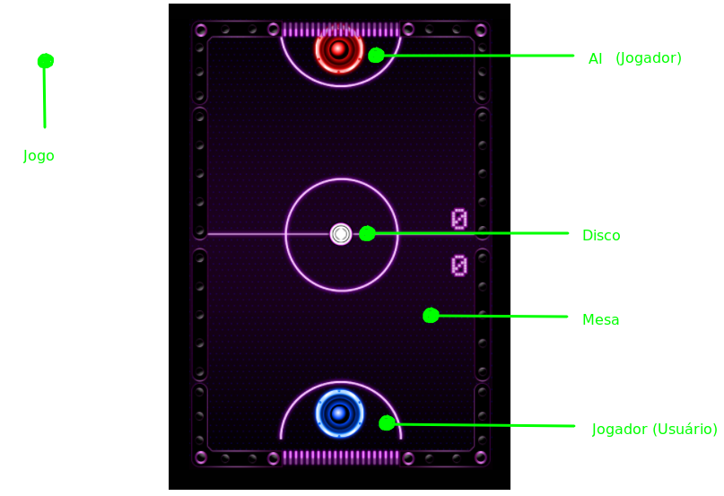
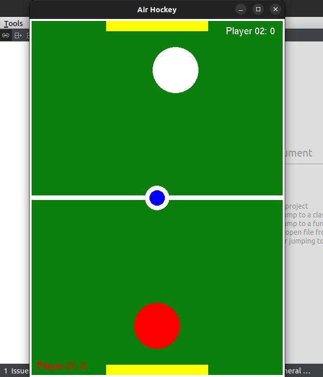

# Air Hockey

-- Como pensamos em estruturar o projeto:

```sh
Projeto Air Hockey
├── include
│   ├── AI.h
│   ├── Disco.h
│   ├── Gol.h
│   ├── Jogador.h
│   ├── Jogo.h
│   └── Mesa.h
├── src
│   ├── AI.cpp
│   ├── Disco.cpp
│   ├── Gol.cpp
│   ├── Jogador.cpp
│   ├── Jogo.cpp
│   └── Mesa.cpp
└── main.cpp
```

## Classe que pensamos em utilizar:

- Classe Jogo: é responsável por gerenciar o loop principal do jogo e lidar com as interações entre os objetos da cena.

- Classe Mesa: é responsável por gerenciar a cena do jogo, ou seja, desenhar a mesa e os objetos nela, como os jogadores, a bola e os gols.

- Classe Gol: é responsável por gerenciar o comportamento dos gols e detectar quando um jogador marcou um ponto.

- Classe Jogador: é responsável por gerenciar os jogadores do jogo, incluindo o jogador controlado pelo usuário e o jogador controlado pela inteligência artificial. Essa classe possui métodos para mover os jogadores, detectar colisões com a bola e com as bordas da mesa.

- Classe AI (opcional): é responsável por gerenciar o jogador controlado pela inteligência artificial, tomando decisões sobre como o jogador deve se mover para tentar marcar um gol.

- Classe Disco: representa a bola do jogo. É responsável por gerenciar o movimento e a colisão da bola com os jogadores e as bordas da mesa.


## Estruturando cada classe:

- Classe Jogo:
    * mesa: Mesa - mesa do jogo
    * jogador1: Jogador - jogador controlado pelo usuário
    * jogador2: Jogador - jogador controlado pela máquina
    * disco: Disco - disco utilizado no jogo
    * vencedor: int - indica o jogador que venceu a partida (0 para empate)

- Classe Mesa:
    * comprimento: float - comprimento da mesa
    * largura: float - largura da mesa
    * cor: vec3 - cor da mesa
    * golEsquerda: Gol - gol esquerda da mesa
    * golDireita: Gol - gol direita da mesa

- Classe Gol:
    * comprimento: float - comprimento do gol
    * largura: float - largura do gol
    * cor: vec3 - cor do gol
    * posicao: vec2 - posição do gol na mesa
    * lado: int - lado do gol na mesa (0 para esquerda e 1 para direita)

- Classe Jogador:
    * raio: float - raio do jogador
    * cor: vec3 - cor do jogador
    * posicao: vec2 - posição do jogador na mesa
    * velocidade: vec2 - velocidade do jogador na mesa
    * tipo: int - tipo do jogador (0 para usuário e 1 para máquina)

- Classe Disco:
    * raio: float - raio do disco
    * cor: vec3 - cor do disco
    * posicao: vec2 - posição do disco na mesa
    * velocidade: vec2 - velocidade do disco na mesa

- Classe AI (opcional):
    * dificuldade: int - nível de dificuldade do jogador controlado pela máquina (0 para fácil, 1 para médio e 2 para difícil)
    * comportamento: string - comportamento do jogador controlado pela máquina (ex: defensivo, agressivo, etc.)


## Inspiração:



## Resultado:



## Versão da estrutura do projeto:
1.0.0

## Autor:

- Paulo Henrique Diniz de Lima Alencar;
- Alysson Lucas Pinheiro;
- Yan Rodrigues.

